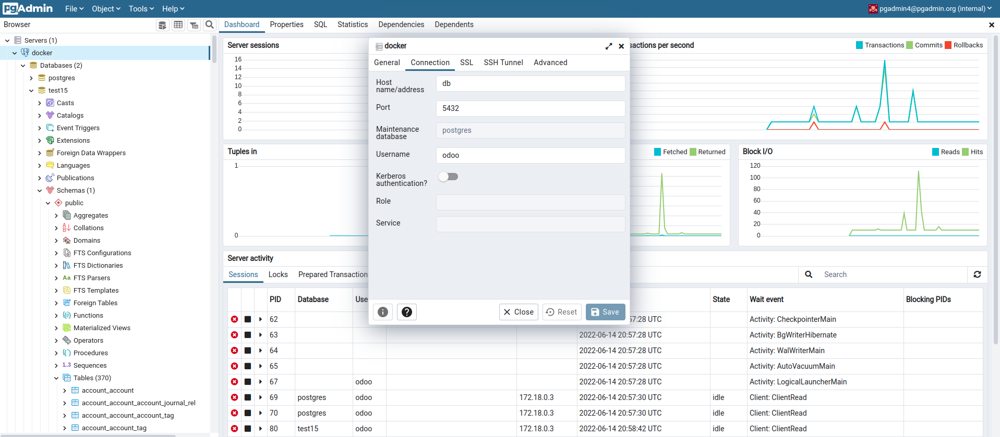

# Odoo 19 Fast Development Environment

Quick Docker-based setup for Odoo 19 development with PostgreSQL 16 and PgAdmin.

## Quick Start

Clone this repo and set up permissions:
```bash
git clone --single-branch --branch 19.0 https://github.com/HoloborodkoBohdan/odoo-docker-compose odoo19
cd odoo19
sudo chmod -R 777 addons etc
```

### Environment Setup

Copy the example environment file and configure it:
```bash
cp .env.example .env
```

Edit `.env` and set your credentials:
- `POSTGRES_PASSWORD` - Database password
- `PGADMIN_DEFAULT_EMAIL` - PgAdmin login email
- `PGADMIN_DEFAULT_PASSWORD` - PgAdmin login password

**Note:** Default ports are configured for fast setup:
- Odoo: `8019`
- PostgreSQL: `6544`
- PgAdmin: `5051`

### Start Development Environment

```bash
docker-compose up -d
```

Access Odoo at: **http://localhost:8019**

To view logs:
```bash
docker-compose logs -f odoo
```

## Custom Addons

Place your custom addons in the **addons/** folder. They will be automatically mounted to `/mnt/extra-addons` in the container.

The development environment includes `--dev=all` for automatic module reloading when you make changes to your addons.

## Configuration

### Odoo Configuration

Edit **etc/odoo.conf** to customize Odoo settings.

Master Password default: `admin0doo` (change this in production!)

Full configuration guide: [Odoo Deployment Documentation](https://www.odoo.com/documentation/19.0/administration/on_premise/deploy.html)

Log file location: **etc/odoo-server.log**

### Port Configuration

To change ports, edit the `.env` file:
- `ODOO_PORT` - Odoo web interface port
- `POSTGRES_PORT` - PostgreSQL external port
- `PGADMIN_PORT` - PgAdmin web interface port

## PgAdmin Access

PgAdmin is available at: **http://localhost:5051**

Login with credentials from your `.env` file (`PGADMIN_DEFAULT_EMAIL` and `PGADMIN_DEFAULT_PASSWORD`).

### Add Odoo Database Server in PgAdmin:

1. Right-click "Servers" → "Register" → "Server"
2. Configure connection:
   - **Name:** Odoo DB (any name)
   - **Host name/address:** `db`
   - **Port:** `5432`
   - **Username:** Value from `POSTGRES_USER` in `.env`
   - **Password:** Value from `POSTGRES_PASSWORD` in `.env`



If you don't need PgAdmin, comment it out in `docker-compose.yml`.

## Docker Services

The environment includes:
- **odoo:19** - Odoo application server with dev mode enabled
- **postgres:16** - PostgreSQL database
- **pgadmin4** - Database management UI
- **odoo-test** - Dedicated test runner (profile: test)

## Development Workflow

1. Add custom modules to `addons/` folder
2. Changes to Python files will auto-reload thanks to `--dev=all` mode
3. For new modules: Update app list in Odoo (Apps → Update Apps List)
4. Install/upgrade your module

**Note:** With `--dev=all` enabled, Odoo automatically reloads when you save changes to your addon files, eliminating the need for manual container restarts during development.

## Testing Modules

### Quick Test with Script

Use the provided test runner script to easily test your custom modules:

```bash
./run-tests.sh my_module
```

This will:
- Install the module in a test database
- Run all module tests
- Display results with color-coded output

#### Advanced Testing Options

```bash
# Test with custom database name
./run-tests.sh my_module custom_test_db

# Update existing module before testing
./run-tests.sh my_module test_db --update

# Run specific test tags
./run-tests.sh my_module test_db --tags post_install

# Set custom log level
./run-tests.sh my_module test_db --log-level debug
```

### Manual Testing with Docker

You can also run tests manually using docker exec:

```bash
# Install module and run tests
docker exec -it odoo_${ODOO_VERSION} odoo \
  -c /etc/odoo/odoo.conf \
  --test-enable \
  --stop-after-init \
  -d test_db \
  -i my_module

# Update existing module and run tests
docker exec -it odoo_${ODOO_VERSION} odoo \
  -c /etc/odoo/odoo.conf \
  --test-enable \
  --stop-after-init \
  -d test_db \
  -u my_module
```

### Using Docker Compose Test Profile

Run tests using the dedicated test service:

```bash
# Run specific module tests
docker-compose run --rm odoo-test -d test_db -i my_module

# Run with specific test tags
docker-compose run --rm odoo-test -d test_db -i my_module --test-tags post_install
```

### Test Database Management

Test databases are separate from your development database:

```bash
# List all databases (including test databases)
docker exec -it postgresql_odoo_${ODOO_VERSION} psql -U odoo -l

# Drop a test database
docker exec -it postgresql_odoo_${ODOO_VERSION} psql -U odoo -c "DROP DATABASE test_db;"
```

### Writing Tests for Your Modules

Place your tests in your module's `tests/` directory:

```
addons/my_module/
├── __init__.py
├── __manifest__.py
├── models/
├── views/
└── tests/
    ├── __init__.py
    ├── test_basic.py
    └── test_advanced.py
```

Example test file:

```python
# addons/my_module/tests/test_basic.py
from odoo.tests import TransactionCase, tagged

@tagged('post_install', '-at_install')
class TestMyModule(TransactionCase):
    def test_basic_functionality(self):
        # Your test code here
        self.assertTrue(True)
```

For more information on Odoo testing, see: [Odoo Testing Documentation](https://www.odoo.com/documentation/19.0/developer/reference/backend/testing.html)

## Stopping the Environment

```bash
docker-compose down
```

To remove all data (fresh start):
```bash
docker-compose down -v
```

## Troubleshooting

**Permission issues:**
```bash
sudo chmod -R 777 addons etc
```

**Reset database:**
```bash
docker-compose down -v
docker-compose up -d
```

**Password authentication failed:**
If you get PostgreSQL authentication errors, ensure the password in `etc/odoo.conf` matches `POSTGRES_PASSWORD` in your `.env` file, then restart:
```bash
docker-compose restart odoo
```

**View container logs:**
```bash
docker-compose logs -f
```

## Version Support

This repository supports multiple Odoo versions via branches:
- 19.0 (current)
- 19.0
- 17.0
- 16.0
- 15.0
- 14.0

Switch versions: `git checkout <version>`
