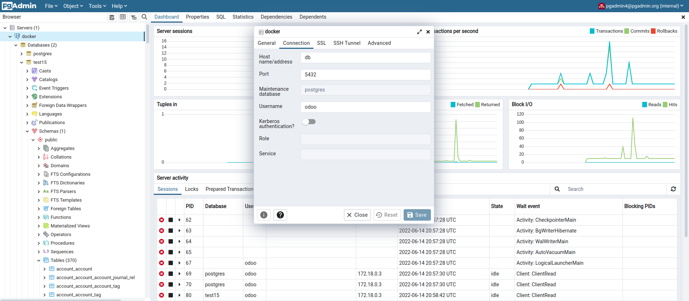

# Odoo 17 docker usage 

Clone this repo with related branch. Change the folder permission to make sure that the container is able to access the directory:
```
git clone --single-branch --branch 17.0 https://github.com/HoloborodkoBohdan/odoo-docker-compose odoo17
```
and then:
```
sudo chmod -R 777 odoo17/addons
sudo chmod -R 777 odoo17/etc
cd odoo17
```

Now you're in folder **odoo17**. Let's start the container:
```
$ docker-compose up
```

* Then open `localhost:8017` to access Odoo 17.0. If you want to start the server with a different port, change **ODOO_PORT** in .env to another value:

```
ports:
 - "8017:8069"
```


* Log file is printed @ **etc/odoo-server.log**

To run in detached mode, execute this command:

```
docker-compose up -d
```

# Custom addons

The **addons** folder contains custom addons. Just put your custom addons if you have any.

# Odoo configuration

Master Password: ```admin0doo```. You can change it into odoo.conf.

To change Odoo configuration, edit file: **etc/odoo.conf**.
Configuration sample: [www.odoo.com/deploy.html](https://www.odoo.com/documentation/17.0/administration/on_premise/deploy.html)

# Access to PgAdmin:

You can use PgAdmin if you need. It's on port 5050 (127.0.0.1:5050 for example) and default credentials are:

* email: pgadmin4@pgadmin.org
* password: admin

If you don't need PgAdmin, you can comment or delete it in docker-compose.yml.

# Add a new server in PgAdmin:

* Host name/address: db
* Port: 5432
* Username as POSTGRES_USER: odoo
* Password as POSTGRES_PASSWORD: odoo



# docker-compose.yml

* odoo:17
* postgres:14
* pgadmin4

# Version Support

This repository supports multiple Odoo versions via branches:
- [20.0](https://github.com/HoloborodkoBohdan/odoo-docker-compose/tree/20.0)
- [19.0](https://github.com/HoloborodkoBohdan/odoo-docker-compose/tree/19.0)
- [18.0](https://github.com/HoloborodkoBohdan/odoo-docker-compose/tree/18.0)
- [17.0](https://github.com/HoloborodkoBohdan/odoo-docker-compose/tree/17.0) (current)
- [16.0](https://github.com/HoloborodkoBohdan/odoo-docker-compose/tree/16.0)
- [15.0](https://github.com/HoloborodkoBohdan/odoo-docker-compose/tree/15.0)
- [14.0](https://github.com/HoloborodkoBohdan/odoo-docker-compose/tree/14.0)

Switch versions: `git checkout <version>`
