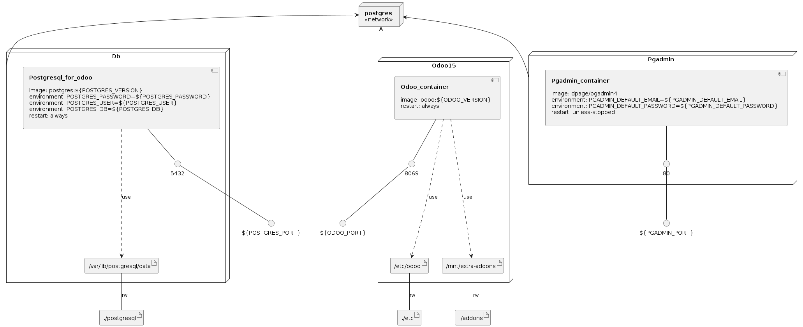

# Odoo docker usage 

This repo contains docker-compose for odoo v14 and up. If you need docker-compose for previous versions, look:

[Odoo 13](https://github.com/HoloborodkoBohdan/odoo-13-docker-compose)

[Odoo 12](https://github.com/HoloborodkoBohdan/odoo-12-docker-compose)

or simply change last version to related odoo version. Keep in mind that you may need to change postgres version also.

## How to try odoo in docker-compose?

Clone this repo with related branch. Change the folder permission to make sure that the container is able to access the directory:
```
git clone --single-branch --branch 15.0 https://github.com/HoloborodkoBohdan/odoo-docker-compose odoo15
sudo chmod -R 777 odoo15/addons
sudo chmod -R 777 odoo15/etc
cd odoo15
```
Now you're in folder **odoo15**. Let's start the container:
```
$ docker-compose up
```

* Then open `localhost:8071` to access Odoo 15.0. If you want to start the server with a different port, change **ODOO_PORT** in .env to another value:

```
ports:
 - "8071:8069"
```


* Log file is printed @ **etc/odoo-server.log**

To run in detached mode, execute this command:

```
docker-compose up -d
```

# Custom addons

The **addons** folder contains custom addons. Just put your custom addons if you have any.

# Odoo configuration

To change Odoo configuration, edit file: **etc/odoo.conf**.
Configuration sample: [www.odoo.com/deploy.html](https://www.odoo.com/documentation/15.0/administration/install/deploy.html#id5)

# Access to PgAdmin:

You can use PgAdmin if you need. It's on port 5050 (127.0.0.1:5050 for example) and default credentials are:

* email: pgadmin4@pgadmin.org
* password: admin

If you don't need PgAdmin, you can comment or delete it in docker-compose.yml.

# Add a new server in PgAdmin:

* Host name/address: db
* Port: 5432
* Username as POSTGRES_USER: odoo
* Password as POSTGRES_PASSWORD: odoo


# docker-compose.yml

* odoo:15
* postgres:13
* pgadmin4

# Odoo 15 screenshots


## To Do
* add links to related docs and useful info
* add cli examples in docker
* add Dockerfile with custom dependencies


### Infrastructure model

